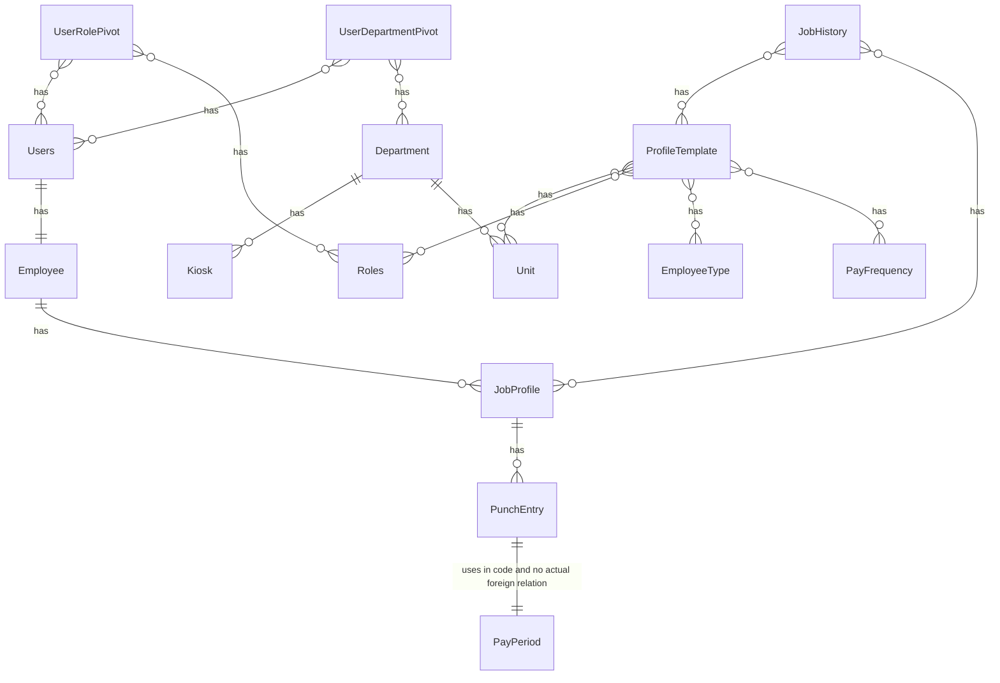

To make the database scalable and efficient we decided to go with `Microsoft SQL database`.



## Authentication and authorization

There are two parts to the authentication and authorization schema and relations in our database. The first one is the `user auth & authorization` and the other one is `kiosk authorization`.

### User auth

The user authentication is required in this system to distinguish users between different roles in the system and to limit the access to resources based on it. We handle it via `EF core built in Identity API`.

```mermaid
erDiagram
  U["Users"] {
    int id
    string? email
    string? username
    string? uniqueId
    Preferences? Preferences
    string password
  }

  R["Roles"] {
    int id
    string name
    string? description
  }

  URP["UserRolePivot"] {
    int id
    int(FK) userId
    int(FK) roleId
  }

  URP }o -- o{ U : has
  URP }o -- o{ R : has
```

:::tip
To learn in detail about the `Identity API` in ASP.net, you can go through their [official learning documentation](https://learn.microsoft.com/en-us/aspnet/core/security/authentication/identity?view=aspnetcore-10.0&tabs=visual-studio).
:::

### Kiosk auth

The kiosk authentication and authorization is handled in the system by a simple `one-to-many relation` between `Department` and `Kiosk` Table. By generating a unique JWT token for each kiosk device and connecting it to the department we can use the `device token` during scanning session to check if the device is `registered` and `properly connected to department` or not.

:::tip
The connection of kiosk device to the department is done at the very first bootup of the web app to the kiosk device by authorized individual only.
:::

```mermaid
erDiagram
  K["Kiosk"] {
    int(PK) id
    string name
    string? description
    string devicetoken
    int(FK) departmentId
  }
  D["Department"] {
    int id
    string name
    string? description
  }

  D || --o{ K : has

```

## Organization

Some of the tables are setup to provide a scalable organization management allowing us to have features such as `multi-departmental job profile`.

```mermaid
erDiagram
  D["Department"] {
    int id
    string name
    string? description
  }
  UR["Users"]
  UDP["UserDepartmentPivot"] {
    int id
    int(FK) UserId
    int(FK) DepartmentId
  }
  U["Unit"] {
    int id
    string name
    string? description
    string index
    int(FK) departmentId
  }

  D || --o{ U : has
  UDP }o -- o{ UR : has
  UDP }o -- o{ D : has
```

Other features like `scalable job profile rules`, `easy job transfer`, and more

```mermaid
erDiagram
  U["Unit"]
  UR["Users"]
  R["Roles"]

  E["Employee"] {
    int id
    string firstName
    string lastName
    string uniqueId
    int(FK) userId
  }
  ET["EmployeeType"] {
    int id
    string name
    string? description
  }
  PF["PayFrequency"] {
    int id
    string name
    string? description
  }
  PT["ProfileTemplate"] {
    int id
    int(FK) UnitId
    int(FK) RoleId
    int(FK) PayFrequencyId
    int(FK) EmployeeTypeId
    time shiftStartTime
    int earlyBufferMin
  }
  JP["JobProfile"] {
    int id
    int(FK) ProfileTemplateId
    int(FK) EmployeeId
    int? earlyBufferMin
  }
  JH["JobHistory"] {
    int Id
    int(FK) JobProfileId
    int(FK) ProfileTemplateId
    date startDate
    date? endDate
  }

  UR || -- || E : has

  E || -- o{ JP : has

  PT }o -- o{ ET : has
  PT }o -- o{ R : has
  PT }o -- o{ U : has
  PT }o -- o{ PF : has

  JH }o -- o{ PT : has
  JH }o -- o{ JP : has
```

## Punch and Report

Finally, some of the tables are designed to create a scalable and efficient punch record and reporting system.

```mermaid
erDiagram
  JP["JobProfile"]
  PP["PayPeriod"] {
    int id
    date startDate
    date endDate
  }
  PE["PunchEntry"] {
    int id
    int(FK) JobProfileId
    timestamp clockIn
    timestamp? clockOut
  }

  JP || -- o{ PE : has
  PE || --|| PP : "uses in code and no actual foreign relation"
```
