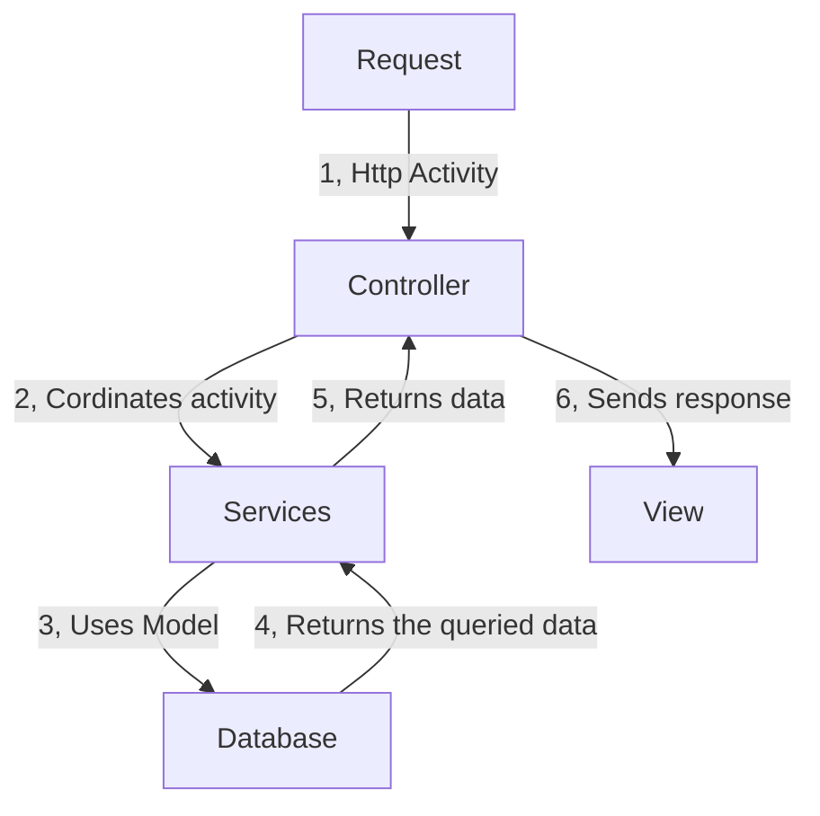

Our dashboard application is built using ASP.NET Core's **Model-View-Controller (MVC)** architectural pattern. By enforcing a strict separation of concerns, the pattern decouples data management, business logic, and the user interface. This separation ensures our application remains modular, highly testable, and clean as the system grows.

---

## The Core Flow of MVC

Understanding how data travels through the system is critical. The diagram below represents the unidirectional data flow cycle triggered by a browser request:



In our full-stack dashboard, the flow maps out step-by-step:

1. **The Request:** A user interacts with the dashboard UI (e.g., loading a list of users) which sends an HTTP request to the server.
2. **The Controller (Brain):** ASP.NET Core routing maps the URL to a specific Controller Action. The Controller coordinates system activity, handles authorization, and communicates with database services.
3. **The Model (Data State):** The Controller retrieves raw domain data from the database, formats it, and packs it into dedicated **ViewModels** designed specifically for the target View.
4. **The View (UI Representation):** The View receives the populated Model, executes server-side Razor logic, renders a static HTML response, and sends it back to the client.

---

## Architectural Breakdown

To keep our dashboard fast and maintainable, we separate our codebase into three distinct layers:

### 1. Models (`Domain` & `ViewModels`)
The Model layer represents the shape of the data. We distinguish between two types of models to prevent exposing our database schema directly to our UI layout:

* **Domain Models:** Define the core business entities (e.g., `User`, `Project`, `TimeEntry`) mapped to our database tables via Entity Framework Core.
* **ViewModels:** Custom-tailored structures constructed solely to feed data to a specific View (e.g., `RoleViewModel`). They hold validation metadata (`[Required]`, `[StringLength]`) and error messaging properties.

### 2. Views (`Views/`)
Views are built using **Razor markup** (`.cshtml`). This allows us to write standard HTML mixed with server-rendered C# logic.

```razor
<!-- Views/Dashboard/Index.cshtml -->
@model TimeManager.Backend.ViewModels.DashboardSummaryViewModel

<div class="dashboard-grid">
    <div class="card">
        <h3>Active Tasks</h3>
        <p class="stat-number">@Model.ActiveTaskCount</p>
    </div>

    <custom-input asp-for="SelectedViewDate" classes="theme-picker" />
</div>
```

### 3. Controllers (`Controllers/`)

Controllers handle incoming HTTP requests, orchestrate application logic, and return appropriate responses (either fully rendered Razor HTML pages, redirects, or JSON API payloads).

```csharp
// Controllers/RoleController.cs
using Microsoft.AspNetCore.Mvc;
using TimeManager.Backend.ViewModels;

namespace TimeManager.Backend.Controllers
{
    public class RoleController : Controller
    {
        [HttpGet]
        public IActionResult Create()
        {
            // Returns the empty form view
            return View(new RoleViewModel());
        }

        [HttpPost]
        [ValidateAntiForgeryToken]
        public async Task<IAction> Create(RoleViewModel rvm) {
          // Logic to validate the model, connect to database and create new role
          // ....

          // return clean new create page
          return View(new RoleViewModel());
        }
    }
}
```
